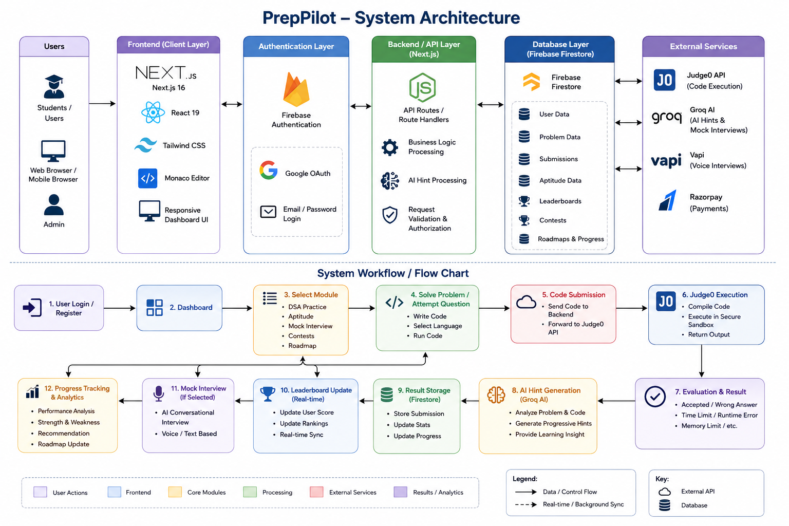

# PrepPilot - Data base Disconnected due to billing issue

Technical interview preparation platform for Indian IT companies. Think LeetCode meets mock interviews, targeted at TCS, Infosys, Wipro, Zoho, Flipkart, and similar.

## System Architecture



## Stack

| Layer | Tech |
|---|---|
| Framework | Next.js 16 (App Router) |
| Auth | Firebase Auth (email/password + Google) |
| Database | Firestore (Blaze, US region) |
| Code execution | Judge0 CE via RapidAPI |
| Editor | Monaco Editor |
| AI | Groq (hints + interview questions) |
| Payments | Razorpay |
| Styling | Tailwind CSS + Material Design 3 tokens |

## Features

- **DSA Practice** — 28 problems across 16 topics, Monaco editor, Judge0 execution, AI hints (4 levels)
- **Aptitude Practice** — 63 MCQ problems across 15 topics
- **Mock Interviews** — AI-driven question/evaluation loop with voice support (Groq)
- **Adaptive Roadmap** — company-weighted topic priority, mastery tracking
- **Contests** — real-time leaderboard via Firestore `onSnapshot`
- **Gamification** — XP, streaks, streak freezes, badges, college leaderboard
- **Editorials + Discussions** — per-problem editorial editor and threaded comments
- **Payments** — Razorpay plan upgrades (Starter / Pro / Premium), interview add-ons
- **Admin panel** — problem/contest management, user management, stats dashboard

## Local setup

1. Clone the repo and install dependencies:
   ```bash
   npm install
   ```

2. Copy `.env.local.example` to `.env.local` and fill in the values:
   ```
   NEXT_PUBLIC_FIREBASE_API_KEY=
   NEXT_PUBLIC_FIREBASE_AUTH_DOMAIN=
   NEXT_PUBLIC_FIREBASE_PROJECT_ID=
   NEXT_PUBLIC_FIREBASE_STORAGE_BUCKET=
   NEXT_PUBLIC_FIREBASE_MESSAGING_SENDER_ID=
   NEXT_PUBLIC_FIREBASE_APP_ID=

   FIREBASE_SERVICE_ACCOUNT_JSON=   # optional — enables server-side plan activation
   GROQ_API_KEY=                    # required for AI hints and mock interviews
   JUDGE0_API_KEY=                  # RapidAPI key for code execution
   RAZORPAY_KEY_ID=
   RAZORPAY_KEY_SECRET=
   ```

3. Start the dev server:
   ```bash
   npm run dev
   ```

4. To seed problems into Firestore:
   ```bash
   npx tsx scripts/seed-problems.ts
   npx tsx scripts/seed-aptitude.ts
   ```

## First admin

Manually set `role: "admin"` on your user document in the Firebase Console. All subsequent role management can be done through the admin panel at `/admin`.

## Deployment

Vercel is the recommended host — it picks up Next.js 16 and environment variables automatically. The `FIREBASE_SERVICE_ACCOUNT_JSON` environment variable must be set in the Vercel dashboard for payments and admin stats to work in production.

## Running tests

```bash
# Unit / integration
npm test

# Playwright e2e
npx playwright test
```
